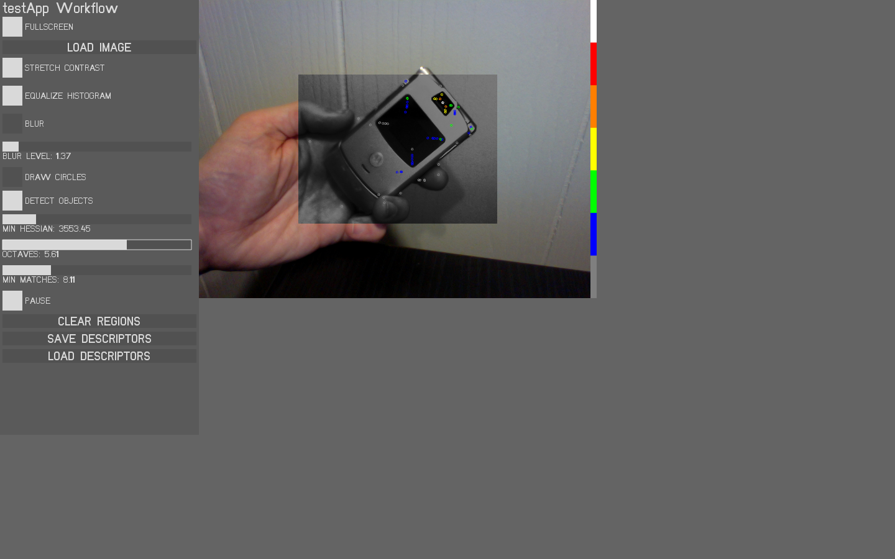
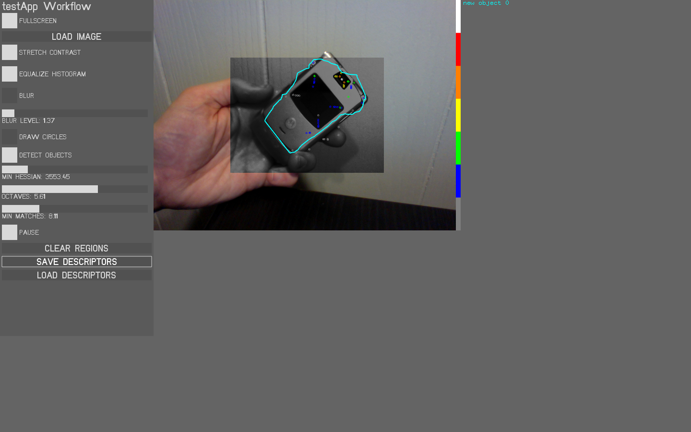

ofxObjectSurfer
=====================================

Introduction
------------
Analyze an image for SURF keypoints. Draw a lasso around the keypoints you would like to use in a detector. Then save object descriptor files. Later, load descriptor files and detect objects in new images.

- Choose an object that generates lots of features. Textures, patterns and text are good candidates for feature detection.

- Circles show the rough size of each detected feature. grey features are the weakest and white are the strongest. The more good features, the better your detector.

- Draw a polygon around the features you want a detector to use.

- Save the object descriptors to a YML file. After saving, and whenever you load the descriptor file, the detector will try to find your object in the latest frame.

Dependencies
------------
ofxOpenCV

Compatibility
------------
0.8.0+

Known issues
------------

Version history
------------
This addon is under development, but can be used as-is.

